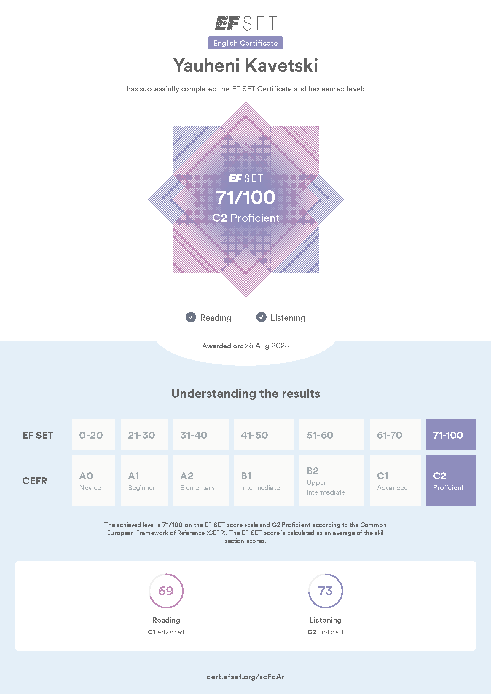

# Yauheni Kavetski - Портфолио

Привет! Меня зовут Евгений Кавецкий (Брест, Беларусь), я начинающий Python-разработчик (также немного владею Java и C#). 
Являюсь нотариальным переводчиком в языковых парах английский-русский и английский_белорусский, также владею польским языком.
20 лет работал в сфере письменного и устного перевода, после чего решил переключиться на IT.

## Мои проекты

- [Python Telegram Bot для поиска отелей](https://github.com/yauheni-kavetski/yauheni_kavetski_telegram_bot_hotels) — бот для поиска и бронирования отелей по API через Amadeus (реализованы: inline-клавиатура, календарь, пагинация, история).
- [Мой Joomla сайт](https://beltran.by)(https://github.com/yauheni-kavetski/yauheni_kavetski_file_synchronization_service) — динамический мультиязычный сайт на Joomla 3 с информацией об оказываемых мною услугах в области перевода текстов.
- [Python File Synchronization Service] — динамический мультиязычный сайт на Joomla 3 с информацией об оказываемых мною услугах в области перевода текстов.

## Навыки

- Python, Java, C#
- Git, GitLab, GitHub
- PyCharm, IntelliJ IDEA, Visual Studio
- Unity
- Joomla
- Работа с API, Telegram Bot API
- Базовый уровень HTML, CSS, PHP
- Английский язык свободно - C2
   

## Контакты

- Telegram: @Euheniyt
- Email: yauhenara@gmail.com

Спасибо за интерес!
 
